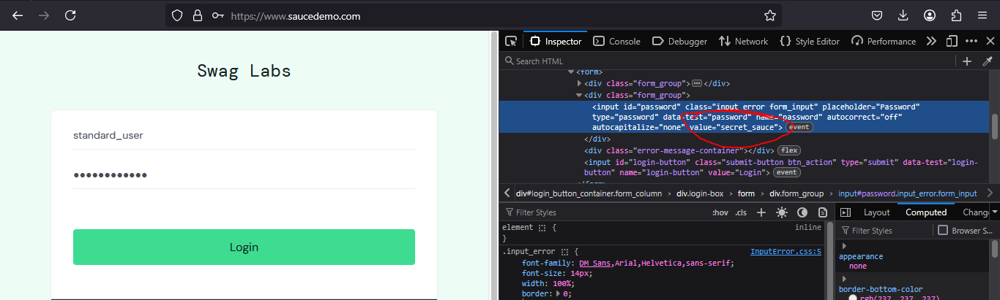
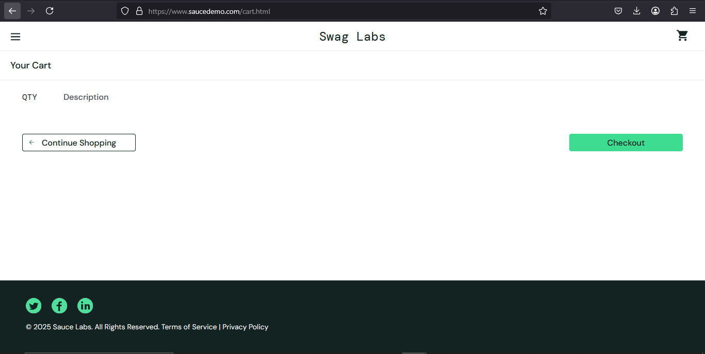
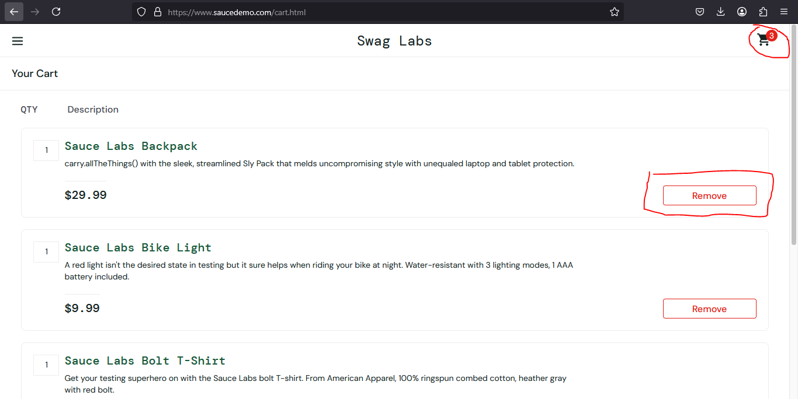

# Bug Report: SauceDemo Functional Issues

**Project:** SauceDemo Web Application  
**Environment:** Chrome Browser (Latest Version), Windows 10  
**URL:** [https://www.saucedemo.com/](https://www.saucedemo.com/)

---

## Bug #1: Password is visible in the input value when inspecting element

- **Severity:** High
- **Steps to Reproduce:**
  1. Open SauceDemo login page.
  2. Enter valid credentials in the username and password fields.
  3. Right-click the password field and select "Inspect" (Developer Tools).
  4. Check the value of the input field.
- **Expected Result:** The password should be hidden (obfuscated) and not visible in the input value attribute.
- **Actual Result:** The password is visible in the "value" attribute.
- **Impact:** Security risk as passwords can be exposed.
- **Screenshot:** 

---

## Bug #2: Check out without any item in the cart

- **Severity:** Medium
- **Steps to Reproduce:**
  1. Log in to SauceDemo.
  2. Click on the cart icon (without adding any items).
  3. Click the "Checkout" button.
  4. Proceed the checkout process.
- **Expected Result:** The system should prevent users from checking out with an empty cart.
- **Actual Result:** The user can proceed with an empty cart.
- **Impact:** Allows invalid transactions, potential order processing issues.
- **Screenshot:** 

---

## Bug #3: Item missing from the cart when removing one item

- **Severity:** Critical
- **Steps to Reproduce:**
  1. Log in and add multiple items to the cart.
  2. Navigate to the cart page.
  3. Remove one item.
  4. Click on the cart icon again.
- **Expected Result:** Only the removed item should be missing; the rest should remain.
- **Actual Result:** Other items also disappear from the cart.
- **Impact:** Incorrect cart functionality, potential purchase issues.
- **Screenshot:** 

---

**Reported By:** Muhammad Reihan Septyansyah
**Date:** 9 Februari 2025  
**Status:** Open
